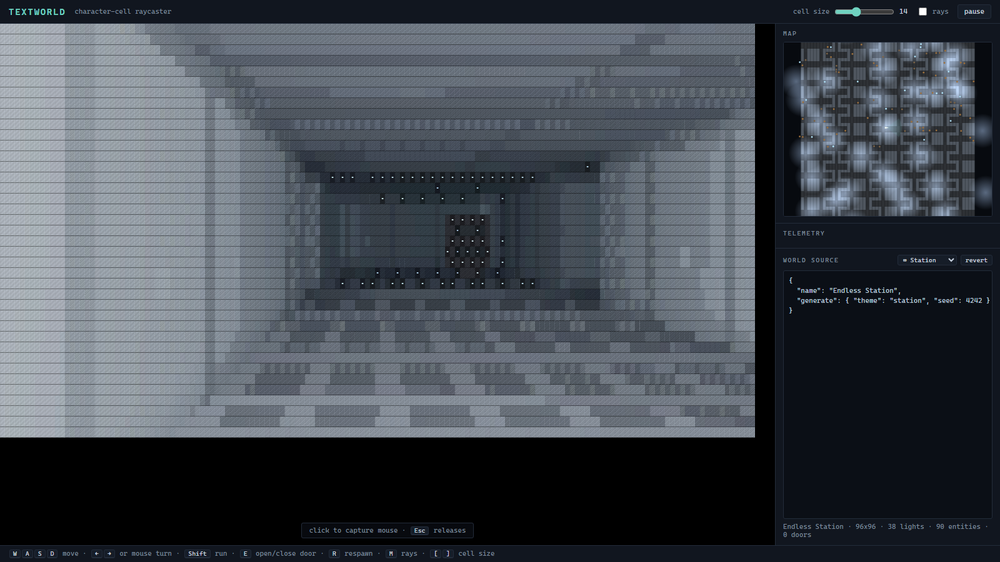
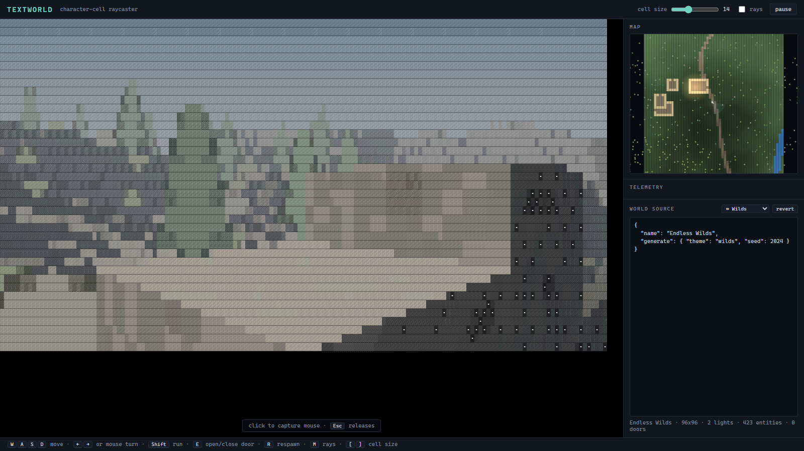
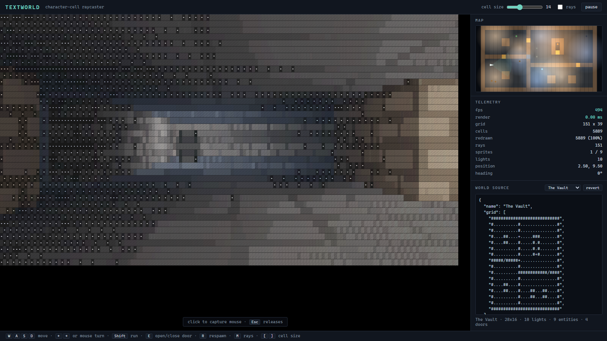

# TextWorld

**[▶ Live Demo](https://granterickson.github.io/TextWorld/)**

A character-cell 3D renderer that runs in the browser. Simple text maps in,
raycast text world out — every "pixel" on screen is a coloured character.

No backend, no runtime dependencies, no WebGL. `npm run build` produces a
folder you can drop on any static host.



## What it does

- **Walks a raycast 3D world drawn entirely in `·░▒▓█`.** Textures, coloured
  lighting, shadows, fog and billboard sprites, all resolved onto a grid of
  characters.
- **Takes an ASCII map.** `{ "grid": ["###", "#.#", "###"] }` is a complete,
  valid world. Everything else has a sane default.
- **Generates endless worlds three ways.** Wave Function Collapse for dungeons
  and stations, noise-based heightmaps for outdoor country, and a street plan
  for the city — with traffic, crowds and a day that turns to night.
- **Holds still.** At rest the image is bit-identical frame to frame; walking,
  fewer than 2% of characters change per frame. See below.
- **Edits live.** The map source sits beside the viewport; change it and the
  world rebuilds without losing your position.

## Quick start

```
npm install
npm run dev        # opens a browser
npm test           # 72 tests, no browser needed
npm run build      # typecheck + test + production build to dist/
```

## Controls

| | |
|---|---|
| `W` `A` `S` `D` | move |
| mouse, or `←` `→` | turn (click the viewport to capture the mouse, `Esc` releases) |
| `Shift` | run |
| `Space` | jump — clears about one tile, enough to scramble up a low ledge |
| `F` | toggle flight; `Space` / `Ctrl` climb and descend |
| `E` | open/close a door |
| `R` | respawn |
| `M` | show the ray fan on the map |
| `G` | cycle the glyph set (blocks / ascii / material) |
| `T` | scrub the clock an hour; hold `Shift` to go back |
| `[` `]` | character cell size |

## The map format

A map is a block of ASCII art plus a legend. Unlisted characters fall back to
sensible defaults — `.` and space are floor, anything else is a wall — so raw
ASCII art is already a working map.

```json
{
  "name": "Two rooms",
  "grid": [
    "############",
    "#....#.....#",
    "#....+.....#",
    "#....#.....#",
    "############"
  ],
  "spawn": { "x": 2.5, "y": 2.5, "angle": 0 },
  "ambient": 0.09,
  "exposure": 2.9,
  "materials": {
    "brick": { "color": "#b08a68", "pattern": "brick", "roughness": 0.8 },
    "wood":  { "color": "#c99a52", "pattern": "planks" }
  },
  "legend": {
    "#": { "wall": "brick" },
    "+": { "door": "wood" }
  },
  "lights": [
    { "x": 3.5, "y": 2.5, "radius": 6, "color": "#ffc890", "intensity": 2, "flicker": 0.25 }
  ],
  "entities": [
    { "sprite": "brazier", "x": 8.5, "y": 2.5, "light": { "radius": 9, "intensity": 2 } }
  ]
}
```

Patterns: `solid` `noise` `rock` `brick` `panel` `grate` `tile` `planks`.
Doors may be `auto` (they open as you approach). Tiles may be `sky` (no
ceiling is drawn — you see stars instead).

### Endless worlds

Replace `grid` with a `generate` block and the world streams forever as you
walk:

```json
{ "name": "Endless Catacombs", "generate": { "theme": "catacombs", "seed": 7 } }
```

Themes: `catacombs`, `caverns`, `station` (dungeon-style, built with Wave
Function Collapse), `wilds`, `badlands` (outdoor heightmaps), and `city`.
Change the seed for a different world in the same style. Anything else the format
understands still layers on top, so `"exposure"` or `"fog"` here overrides
whatever the theme picked.

## The worlds

Nine are built in, selectable from the dropdown. The city is the default.

**Hand-authored:** *The Vault* (a lit dungeon with doors, a patrolling drone
and a sealed brazier alcove), *Night Court* (an open cloister under stars) and
*First Light* (the smallest thing that still reads as a room — no legend, no
materials, just ASCII art).

**Generated dungeons** learn from a small block of sample art and emit more of
it forever. Adding a world type means drawing a new sample, not writing code.

**Generated outdoors** are heightmaps: hills, cliffs, rivers, roads, trees,
shrubs, boulders and walled settlements, spread across four biomes each.

**The generated city** is a street plan rather than a landscape, read in
order — streets, then pavements, then blocks, then lots, then what stands on
them. Street lines are jittered by their *index*, so a street runs unbroken
from one edge of the world to the other while the blocks between them vary in
width. Buildings vary lot by lot into a skyline; traffic keeps a lane, brakes
for a red and queues; people walk the pavements; trees line the kerbs. One
value drives the whole day — sun, sky, fog, stars and whether the lamps have
come on.



## Why it holds still

Text is a brutally low-resolution medium, and anything that jitters reads as
noise rather than detail. Stability is enforced at four separate layers:
textures are welded to world space, the dither is screen-space, glyphs have
hysteresis so a cell near a ramp threshold cannot flip on rounding error, and
there is deliberately no head bob.

Measured on a 151×39 grid:

| | cells repainted | **glyph changes** |
|---|---|---|
| still camera | 0.0% | 0.0% |
| still, torches flickering | 32% | **0.0%** |
| turning 20°/s | 44% | **1.9%** |
| walking 2.6 tiles/s | 64% | **1.7%** |

The gap between the two columns is the point: under motion the *characters*
stay put and only their colours move, so flickering torchlight reads as light
rather than as churn.

## Why it looks like light rather than ASCII

Mapping brightness to a glyph on a luminance ramp throws away most of the
available precision. Instead each cell is treated as a mix —
`density * fg + (1 - density) * bg` — and the renderer solves for the
foreground colour, so a cell's *average* colour matches the light that actually
arrived. Six glyphs render smooth gradients.



## Layout

```
src/main.ts          wiring: DOM controls, frame loop, live map rebuilds
src/maps.ts          the built-in worlds
src/engine/          renderer, raycaster, lighting, shading, generators
src/ui/              canvas text grid, input, minimap
```

The engine is DOM-free, which is why the tests run under plain Node with no
browser and no test framework — `node --test` and the built-in assert module.
It also means you can render a frame to your terminal, which is by far the
fastest way to inspect a change.

Architecture notes, the reasoning behind the awkward parts, and a guide to
tuning a map's lighting are in [CLAUDE.md](CLAUDE.md).

## Known limits

- **City buildings cannot yet be entered.** A tile carries one surface, so it
  cannot be both a floor and the ceiling below it, and the terrain renderer
  never draws an underside. The design for lifting that — columns as a list of
  solid spans, and the renderer's y-buffer generalised to a per-column
  coverage mask — is written up in CLAUDE.md, and the per-tile data it needs
  is already generated.
- Generated outdoor buildings are roofless walled compounds, for the same
  reason.
- Trees are camera-facing billboards. Vehicles and people are drawn from their
  long side or their end, but foliage would need several rotations of art.
- Generated worlds have no doors yet; door state would have to survive the
  tile rebuild that happens on every window shift.
- The sun does not cast shadows outdoors — surfaces are shaded by slope only.
- Outdoor terrain is stable everywhere, but dungeon terrain is only stable
  within roughly one streaming window; walk far enough away and back and a
  dungeon regenerates differently.
